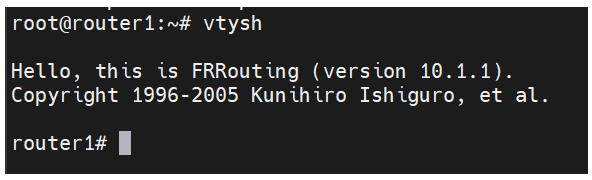
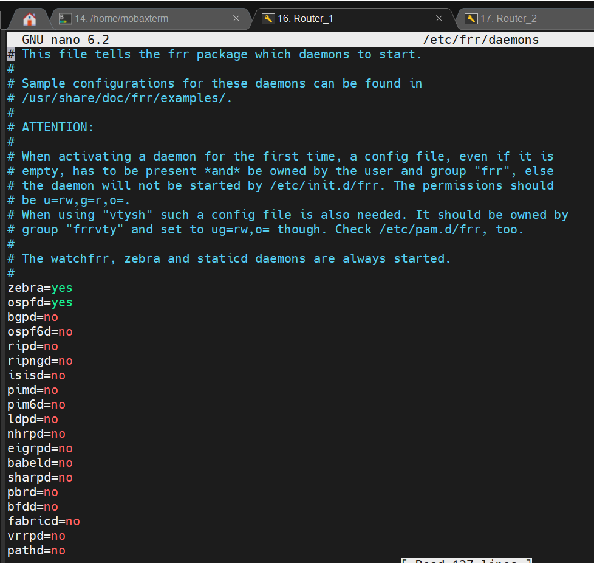
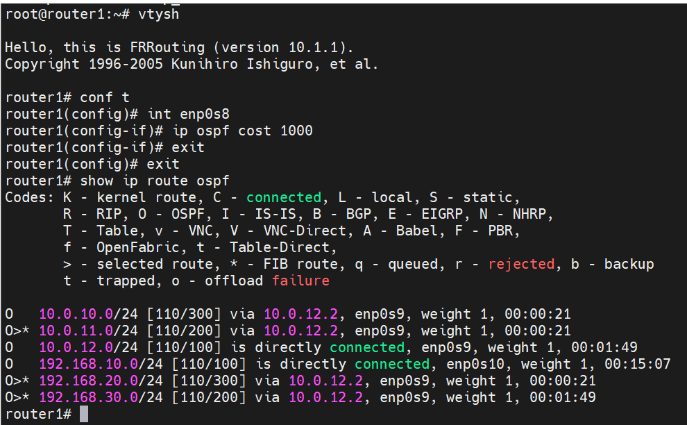

# homework-OSPF

Описание домашнего задания
---
1. Развернуть 3 виртуальные машины


2. Объединить их разными vlan

- настроить OSPF между машинами на базе Quagga;


- изобразить ассиметричный роутинг;

  
- сделать один из линков "дорогим", но что бы при этом роутинг был симметричным.


---
ОС для настройки: ubuntu 22_04 (7 виртуальных машин)

Vagrant версии 2.4.1

VirtualBox версии 7.0.18

FRR версии 10.1.1


Топология настраиваемой сети


---
- Этап 1: Установка пакетов для тестирования и настройки OSPF


**Делаем на всех роутерах. Отличия в настройках будут явно указаны**

```bash
apt update
apt install vim traceroute tcpdump net-tools
```


---
- Этап 2: Настройка OSPF между машинами на базе Quagga

*настойка OSPF будет осуществляться в FRR*


**Отключаем файерволл ufw и удаляем его из автозагрузки:**

```bash
   systemctl stop ufw 
   systemctl disable ufw
```


**Добавляем gpg ключ**

```bash
curl -s https://deb.frrouting.org/frr/keys.asc | sudo apt-key add -
```

**Добавляем репозиторий c пакетом FRR**

```bash
echo deb https://deb.frrouting.org/frr $(lsb_release -s -c) frr-stable > /etc/apt/sources.list.d/frr.list
```


**Обновляем пакеты и устанавливаем FRR**

```bash
sudo apt update
sudo apt install frr frr-pythontools
```




**Разрешаем (включаем) маршрутизацию транзитных пакетов**

```bash
sysctl net.ipv4.conf.all.forwarding=1
```


**Включаем демон ospfd в FRR**


Для этого открываем в редакторе файл /etc/frr/daemons и меняем в нём параметры для пакетов zebra и ospfd на yes:


*Zebra добавил сам, его не было в конфиге*





**Настройка OSPF**


Для настройки OSPF нам потребуется создать файл /etc/frr/frr.conf который будет содержать в себе информацию о требуемых интерфейсах и OSPF. 

**Узнаем имена интерфейсов**

```bash
ip a | grep inet 
# ЛИБО
vtysh
show interface brief
```

**Router 1**


**Router 2**


**Router 3**


**Создаём файл /etc/frr/frr.conf и вносим в него следующую информацию:**


*Восклицательные знаки реально должны быть в конфиге, это нормально*

```bash
!Указание версии FRR
frr version 10.1.1
frr defaults traditional
!Указываем имя машины
hostname router1
log syslog informational
no ipv6 forwarding
service integrated-vtysh-config
!
!Добавляем информацию об интерфейсе enp0s8
interface enp0s8
 !Указываем имя интерфейса
 description r1-r2
 !Указываем ip-aдрес и маску (эту информацию мы получили в прошлом шаге)
 ip address 10.0.10.1/30
 !Указываем параметр игнорирования MTU
 ip ospf mtu-ignore
 !Если потребуется, можно указать «стоимость» интерфейса
 !ip ospf cost 1000
 !Указываем параметры hello-интервала для OSPF пакетов
 ip ospf hello-interval 10
 !Указываем параметры dead-интервала для OSPF пакетов
 !Должно быть кратно предыдущему значению
 ip ospf dead-interval 30
!
interface enp0s9
 description r1-r3
 ip address 10.0.12.1/30
 ip ospf mtu-ignore
 !ip ospf cost 45
 ip ospf hello-interval 10
 ip ospf dead-interval 30

interface enp0s10
 description net_router1
 ip address 192.168.10.1/24
 ip ospf mtu-ignore
 !ip ospf cost 45
 ip ospf hello-interval 10
 ip ospf dead-interval 30 
!
!Начало настройки OSPF
router ospf
 !Указываем router-id 
 router-id 1.1.1.1
 !Указываем сети, которые хотим анонсировать соседним роутерам
 network 10.0.10.0/30 area 0
 network 10.0.12.0/30 area 0
 network 192.168.10.0/24 area 0 
 !Указываем адреса соседних роутеров
 neighbor 10.0.10.2
 neighbor 10.0.12.2

!Указываем адрес log-файла
log file /var/log/frr/frr.log
default-information originate always
```

**На хостах router2 и router3 также потребуется настроить конфигруационные файлы, предварительно поменяв ip -адреса интерфейсов**


Вот что потребуется поменять соответственно на роутерах 2 и 3:

**hostname**

**description**

**ip address**

**network**

**neighbor**

**router-id**


**Проверяем владельца файлов /etc/frr/frr.conf и /etc/frr/daemons**

Надо, чтобы владельцем файла является пользователь frr. Группа файла также должна быть frr. Должны быть установленны следующие права:
у владельца - на чтение и запись
у группы - только на чтение


Если права или владелец файла указан неправильно, то нужно поменять владельца и назначить правильные права, например:

```bash
chown frr:frr /etc/frr/frr.conf 
chmod 640 /etc/frr/frr.conf 
```


**Перезапускаем FRR и добавляем его в автозагрузку**

```bash
systemct restart frr 
systemctl enable frr
```


**Проверям, что OSPF перезапустился без ошибок**
**У роутеры 3 уже видим каких-то соседей!**


**Проверим доступность сетей с хоста router1:**


```bash
ping 192.168.30.1
```


**Запустим трассировку до адреса 192.168.30.1**

```bash
traceroute 192.168.30.1
```


**Попробуем отключить интерфейс enp0s9 и немного подождем и снова запустим трассировку до ip-адреса 192.168.30.1**

```bash
ifconfig enp0s9 down
ip a | grep enp0s9 
traceroute 192.168.30.1
```


**Как мы видим, после отключения интерфейса сеть 192.168.30.0/24 нам остаётся доступна**


**Также мы можем проверить из интерфейса vtysh какие маршруты мы видим на данный момент**

```bash
vtysh
show ip route ospf
```


Включим интерфейс обратно


---
- Этап 2: Настройка ассиметричного роутинга


**Для настройки ассиметричного роутинга нам необходимо выключить блокировку ассиметричной маршрутизации**

**Так же, на всех роутерах выполняем!**

```bash
sysctl net.ipv4.conf.all.rp_filter=0
```


**Далее, выбираем один из роутеров, на котором изменим «стоимость интерфейса». Например поменяем стоимость интерфейса enp0s8 на router1**

```bash
vtysh
conf t
int enp0s8 
ip ospf cost 1000
exit
exit
show ip route ospf
```




**Смотрим маршруты на роутере 2**


**После внесения данных настроек, мы видим, что маршрут до сети 192.168.20.0/30  теперь пойдёт через router2, но обратный трафик от router2 пойдёт по другому пути. Для проверки**

На router1 запускаем пинг от 192.168.10.1 до 192.168.20.1: 


**На router2 запускаем tcpdump, который будет смотреть трафик только на порту enp0s9**


**Видим что данный порт только получает ICMP-трафик с адреса 192.168.10.1**


**На router2 запускаем tcpdump, который будет смотреть трафик только на порту enp0s8**


**Видим что данный порт только отправляет ICMP-трафик на адрес 192.168.10.1**

**Таким образом мы видим ассиметричный роутинг**


---
- Этап 3: Настройка симметичного роутинга


Так как у нас уже есть один «дорогой» интерфейс, нам потребуется добавить ещё один дорогой интерфейс, чтобы у нас перестала работать ассиметричная маршрутизация. 


Так как в прошлом задании мы заметили что router2 будет отправлять обратно трафик через порт enp0s8, мы также должны сделать его дорогим и далее проверить, что теперь используется симметричная маршрутизация:


Поменяем стоимость интерфейса enp0s8 на router2:


**На роутере 2 работаем**


```bash
vtysh
conf t
int enp0s8
ip ospf cost 1000
exit
exit
show ip route ospf
```


**После внесения данных настроек, мы видим, что маршрут до сети 192.168.10.0/30  пойдёт через router2. Проверим**


**На router1 запускаем пинг от 192.168.10.1 до 192.168.20.1**


**На router2 запускаем tcpdump, который будет смотреть трафик только на порту enp0s9**


**Теперь мы видим, что трафик между роутерами ходит симметрично**
